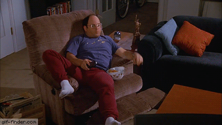

# George

<p align="center">
  <a href="https://www.youtube.com/watch?v=ZPS3qLtaFtw" target="_blank">
	
  </a>
</p>

**Neural Style [Vagrant](https://www.vagrantup.com/) provisioning script.**

## Installation

Manually [Install Vagrant](https://www.vagrantup.com) and [VirtualBox](https://www.virtualbox.org/wiki/Downloads). **OR**, macOS users, install using [Homebrew](https://brew.sh/):

```bash
$ brew cask install virtualbox vagrant vagrant-manager
# Bonus! Use this to update previously installed casks:
$ brew cask outdated | xargs brew cask reinstall
```

Create a directory for your Vagrant projects; I put mine here:

```text
~/dev/vagrant/<name of project>
```

Install this code:

1. Download as a [`zip`](../../archive/master.zip).
1. Clone it: `$ git clone https://github.com/mhulse/george.git`.
1. Fork it and clone: `$ git clone git@github.com:<username>/george.git`.

As a convenience to **macOS** users, from the command line, navigate to `vagrant/<name of project>` directory and run:

```bash
$ bash <(curl -sL https://git.io/vbMmP)
```

Next, from within your project directory, run:

```bash
$ vagrant up
```

This command will download (first time), configure and start the virtual machine. Note that a “synced folder” named `/neural_style/` (`/home/vagrant/neural-style/` on guest machine) will appear in the project’s root (on your host machine).

> Synced folders enable Vagrant to sync a folder on the host machine to the guest machine, allowing you to continue working on your project's files on your host machine, but use the resources in the guest machine to compile or run your project.

Once the VM is up, you can ssh into the current running Vagrant box:

```bash
$ vagrant ssh
```

You are now connected to the Vagrant box at `/home/vagrant`.

## Neural Style

```bash
# Check if torch is working:
$ th
# … and type `exit` to close the interactive shell.
$ cd ~/neural-style
# Check if neural style is working with this command:
$ th neural_style.lua -gpu -1 -print_iter 1
# Instructions about how to use neural style:
$ th neural_style.lua ?
# Create a test image (out.png is end result):
$ th neural_style.lua -style_image examples/inputs/picasso_selfport1907.jpg -content_image examples/inputs/shipwreck.jpg -gpu -1 -image_size 256
# Put your images in the `neural-style` dir and make one at ~8.625" X 8.75" @ 300ppi (2588px X 2625px):
$ th neural_style.lua -style_image images/style_image.jpg -content_image images/content_image.jpg -gpu -1 -num_iterations 2000 -seed 123 -image_size 2625
```

If the above works, then use the synced directory to move images in/out of the guest machine and start creating your own neural-style imagery!

## Vagrant tips

Here’s a few useful commands:

```bash
# Start VM:
$ vagrant up
# Reload, no provision:
$ vagrant reload
# Reload and provision:
$ vagrant reload --provision
# SSH into VM:
$ vagrant ssh
# Disconnect from VM:
$ logout
# … or:
$ exit
# Suspend the guest machine:
$ vagrant suspend
# Stop VM:
$ vagrant halt
# Deallocate virtual machine resources:
$ vagrant destroy
# Remove the box file:
$ vagrant box remove <name>
```

When running `vagrant up`, Vagrant will install dependencies as defined by the provisioning script(s); this is called “[Automatic Provisioning](https://www.vagrantup.com/intro/getting-started/provisioning.html)”.

If you make any modifications to the [`Vagrantfile`](Vagrantfile), `reload` should be called.

If you make changes to your `Vagrantfile`’s provisioner’s (i.e., [`bootstrap.sh`](bootstrap.sh)), you’ll want to call `reload --provision`.

A full list of Vagrant’s CLI commands can be found here: [Command-Line Interface](https://www.vagrantup.com/docs/cli/).

## Links

- [neural-style](https://github.com/jcjohnson/neural-style)
- [neural-style Installation](https://github.com/jcjohnson/neural-style/blob/master/INSTALL.md)
- [Getting started with Torch](http://torch.ch/docs/getting-started.html)
- [Create Your Own "Neural Paintings" using Deep Learning](https://www.linux.com/blog/create-your-own-neural-paintings-using-deep-learning)
- [NeuralTalk2](https://github.com/karpathy/neuraltalk2)

## Legal

Copyright © 2018 [Michael Hulse](http://mky.io).

Licensed under the Apache License, Version 2.0 (the “License”); you may not use this work except in compliance with the License. You may obtain a copy of the License in the LICENSE file, or at:

[http://www.apache.org/licenses/LICENSE-2.0](http://www.apache.org/licenses/LICENSE-2.0)

Unless required by applicable law or agreed to in writing, software distributed under the License is distributed on an “AS IS” BASIS, WITHOUT WARRANTIES OR CONDITIONS OF ANY KIND, either express or implied. See the License for the specific language governing permissions and limitations under the License.


